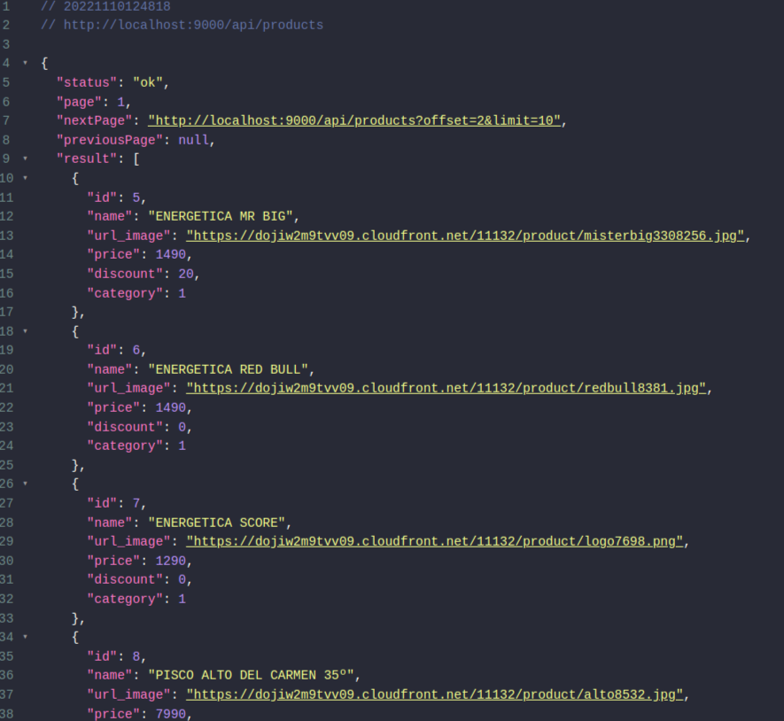
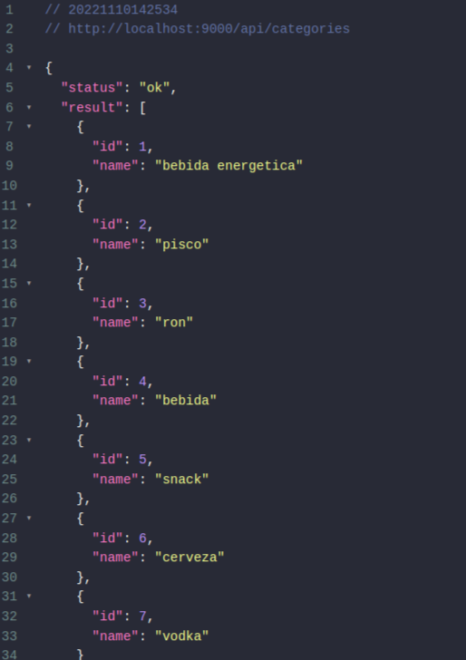
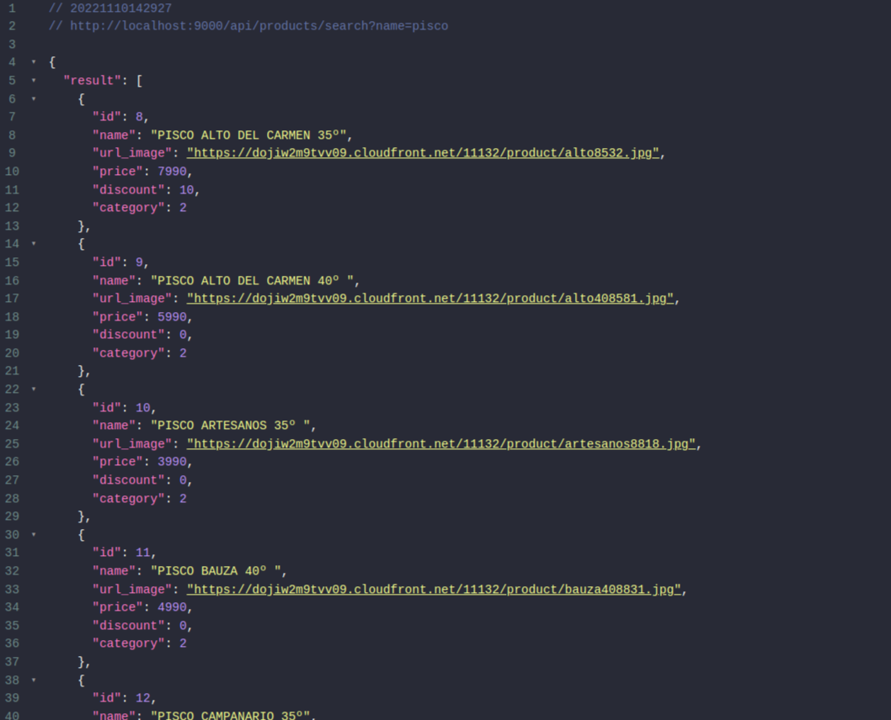

# Bsale_test-API-REST

Objetivo: Generar una API-REST 

## Detalle de la aplicacion 

Crear una API-REST conectada a una base de datos cuyo proposito sera tener la informacion necesaria de los productos y posteriormente desplegarla en la tienda online.
La aplicacion fue hecha utilizando las siguientes tecnologias:

- Nodejs
- MYSQL
- Express

## Detalles de la peticion
Al realizar una peticion HTTP al siguiente endpoint:
```
https://bsaletestbackend-production.up.railway.app/api/products
```

 el servidor devolvera un json con la siguiente estructura:
 

- *ok* : Estado de la peticion.
- *page* : Pagina en la que te encuentras (**int**).
- *previousPage* : Muestra el endpoint para la pagina anterior (**int**)
- *nextPage* : Mustra el endpoint para la siguiente pagina (**int**).
- *result* : Informacion general de los productos.

### Paginacion
Al realizar la peticion 

**ejemplo**

```
https://bsaletestbackend-production.up.railway.app/api/products?page=1&perpage=10
```
Te mostrara lo siguiente :


Ahora offset cambio a 2 esto significa que te dirigiste a la otra pagina.

**limit** sigue igual pero si quieres puedes pasarle la cantidad de productos que quieres que te muestre (**int**). 


### Categoria
Si quieres acceder a las categorias puedes usar esto:


```
https://bsaletestbackend-production.up.railway.app/api/products/category
```
te mostrara lo siguiente :



### Buscar productos
Si deseas buscar productos mas especificos lo puedes hacer pasandole el nombre como parametro:

**ejemplo**

```
https://bsaletestbackend-production.up.railway.app/api/products/q?name=pisco
```


